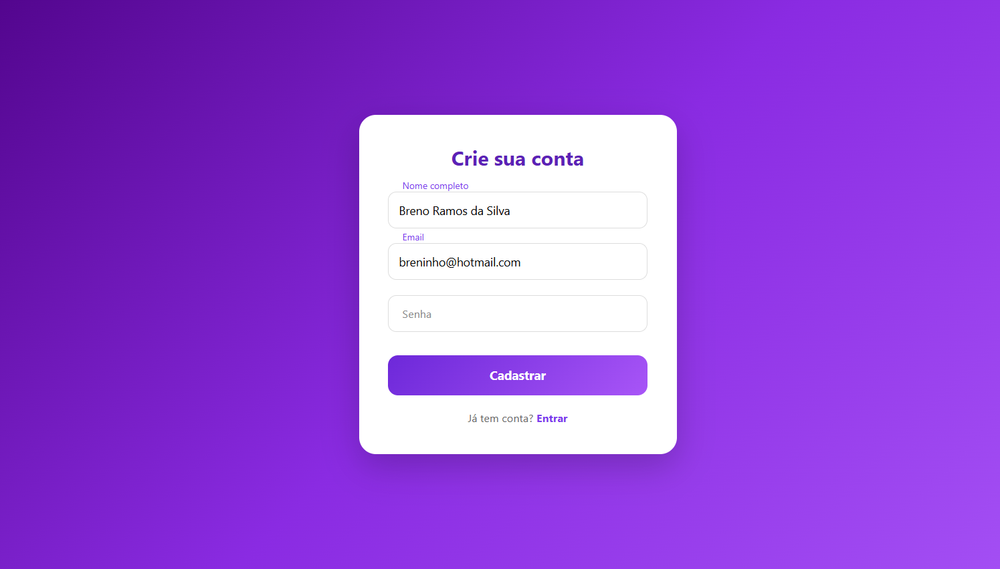

# 🔐 Login Fullstack

Projeto de estudo desenvolvido para entender na prática como conectar **frontend**, **backend** e **banco de dados** em uma aplicação web completa. Simples por fora, mas com toda a estrutura real de uma aplicação em produção.

---

## 📸 Preview



---

## 🚀 Tecnologias

### Backend
- **Node.js** — ambiente de execução JavaScript
- **Express** — framework para criação da API REST
- **MySQL** — banco de dados relacional

### Frontend
- **HTML5** — estrutura da página
- **CSS3** — estilização da interface

---

## 💡 O que esse projeto cobre

- Conexão real entre frontend e backend via `fetch()` e API REST
- Integração do backend com banco de dados MySQL
- Recebimento e validação de dados de login no servidor
- Resposta do backend para o frontend com status da autenticação
- Fluxo completo: usuário preenche o formulário → frontend envia para a API → API consulta o banco → responde com sucesso ou erro

---

## 📁 Estrutura do projeto

```
login-fullstack/
├── backend/
│   ├── server.js          # Servidor Express e rotas
│   ├── db.js              # Conexão com o MySQL
│   └── package.json
├── frontend/
│   ├── index.html         # Tela de login
│   └── style.css          # Estilos
└── README.md
```

---

## ⚙️ Como rodar localmente

### Pré-requisitos

- [Node.js](https://nodejs.org/) instalado
- [MySQL](https://www.mysql.com/) instalado e rodando

### 1. Clone o repositório

```bash
git clone https://github.com/seu-usuario/login-fullstack.git
cd login-fullstack
```

### 2. Configure o banco de dados

Crie o banco e a tabela de usuários no MySQL:

```sql
CREATE DATABASE login_db;

USE login_db;

CREATE TABLE usuarios (
  id INT AUTO_INCREMENT PRIMARY KEY,
  email VARCHAR(255) NOT NULL UNIQUE,
  senha VARCHAR(255) NOT NULL
);

-- Insira um usuário de teste
INSERT INTO usuarios (email, senha) VALUES ('teste@email.com', '123456');
```

### 3. Configure as variáveis de ambiente

Dentro da pasta `backend/`, crie um arquivo `.env`:

```env
DB_HOST=localhost
DB_USER=root
DB_PASSWORD=sua_senha
DB_NAME=login_db
PORT=3000
```

### 4. Instale as dependências e suba o servidor

```bash
cd backend
npm install
node server.js
```

### 5. Abra o frontend

Abra o arquivo `frontend/index.html` diretamente no navegador, ou use uma extensão como o **Live Server** no VS Code.

---

## 🔄 Fluxo da aplicação

```
Usuário preenche o formulário
        ↓
Frontend faz fetch() → POST /login
        ↓
Backend recebe email + senha
        ↓
Consulta o banco de dados MySQL
        ↓
Retorna { ok: true } ou { ok: false, mensagem }
        ↓
Frontend exibe o resultado na tela
```

---

## 📚 O que aprendi com esse projeto

- Como usar `fetch()` para consumir uma API no frontend
- Como criar rotas com Express e receber dados do body (`req.body`)
- Como conectar o Node.js ao MySQL e fazer queries
- Como tratar erros e retornar respostas HTTP adequadas (`200`, `401`, etc.)
- A importância do CORS ao ligar frontend e backend em portas diferentes

---

## 🛠️ Melhorias futuras

- [ ] Hash de senha com **bcrypt**
- [ ] Autenticação com **JWT**
- [ ] Tela de cadastro de usuários
- [ ] Validação dos campos com **Zod**
- [ ] Refresh token

---

## 👤 Autor

Feito por **Luiz** · Em construção 🚧

[](https://www.linkedin.com/in/luiz-fernando-de-oliveira-fardim-3b1a963a6/)
[](https://github.com/luiz-fardim)